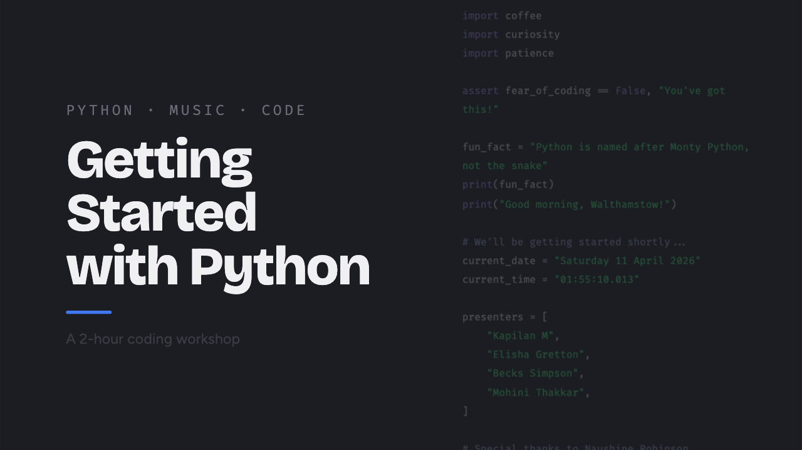
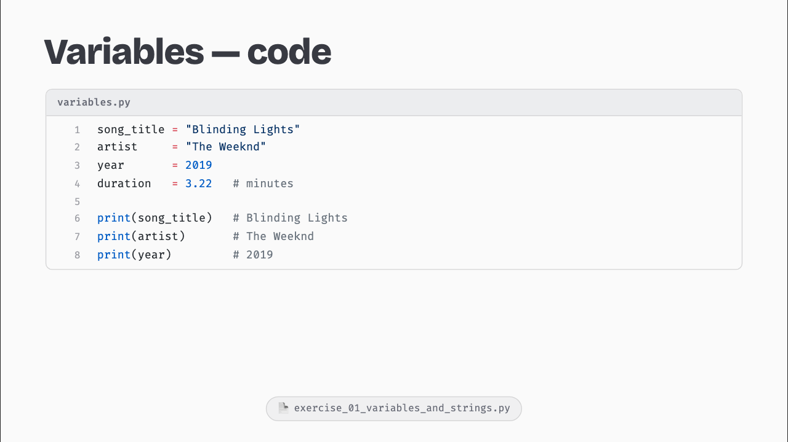
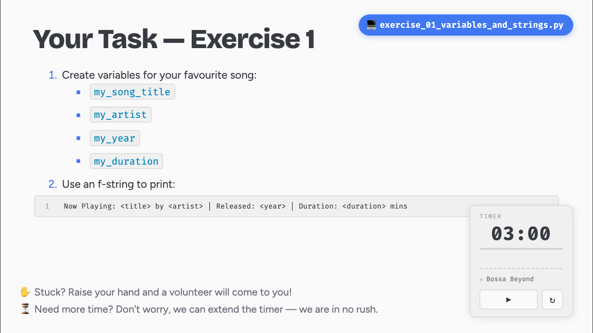
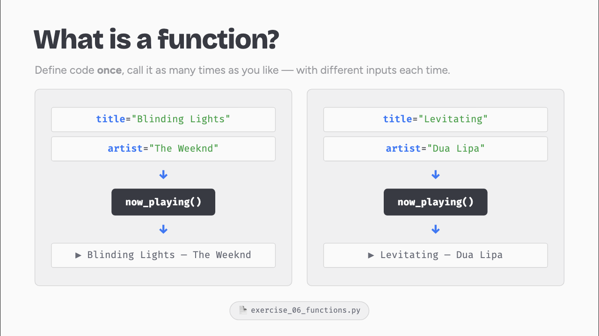

# Slides — Dev Setup

Slidev presentation for the Python & the Music World workshop.

## Prerequisites

- **Node 22** — use [nvm](https://github.com/nvm-sh/nvm) and run `nvm use` (`.nvmrc` pins v22)
- No other global installs needed

## Install

```bash
cd slides
npm install
```

This installs Slidev, the default theme, and Playwright (for screenshots).

## Dev server

```bash
npm run dev
```

Opens the presentation at `http://localhost:3030`. Hot-reloads on changes to `slides.md` or `style.css`.

## Files

| File / folder | Purpose |
|---|---|
| `slides.md` | All slide content — one `---` separator per slide |
| `style.css` | Global styles (Atom One Light palette, custom diagram classes) |
| `components/CodeBlock.vue` | Interactive code block — click lines to highlight, Shiki syntax highlighting |
| `screenshot-slides.js` | Playwright script: screenshots every slide to `screenshots/` |
| `screenshot-step.js` | Playwright script: screenshots specific slides at mid-click state |

## Authoring notes

**Code slides** use the custom `<CodeBlock>` component, not Slidev's built-in fenced blocks:

```markdown
<script setup>
const code = `print("hello")`
</script>

<CodeBlock :code="code" lang="python" filename="hello.py" />
```

**Important:** Never leave a blank line inside an HTML block (`<div>`, `<pre>`, etc.) in `slides.md`. CommonMark terminates HTML blocks at the first blank line, which breaks Vue template compilation. Keep code strings in `<script setup>` template literals instead.

**Layouts** — the first slide's layout and class are set in the global frontmatter (the very first `---` block), not in a per-slide frontmatter block.

## Exporting

```bash
npm run build     # static site → dist/
npm run export    # PDF → slides-export.pdf (requires a running dev server)
```

## Screenshots

Requires the dev server to be running on port 3030.

```bash
# Screenshot all slides
node screenshot-slides.js

# Screenshot specific slides at a clicked state (for review)
node screenshot-step.js
```

Output goes to `screenshots/`. The folder is gitignored.

## Preview

**Cover slide** — dark theme with live Python code panel on the right



**Code slide** — Shiki syntax highlighting with a filename tab header and a linked exercise file badge at the bottom



**Task slide with countdown timer** — a floating timer widget (play/reset, ambient music label) appears on every exercise slide; a file badge in the top-right links to the relevant exercise file



**Concept diagram** — visual explanations use custom diagram layouts to show function inputs, outputs, and reuse



## Playwright quirk on macOS

If you're running scripts from a non-interactive shell (e.g. a script or CI), nvm may not be on the PATH. Use the direct binary path:

```bash
env -i HOME="$HOME" PATH="$HOME/.nvm/versions/node/v22.16.0/bin:/usr/local/bin:/usr/bin:/bin" \
  node screenshot-slides.js
```
